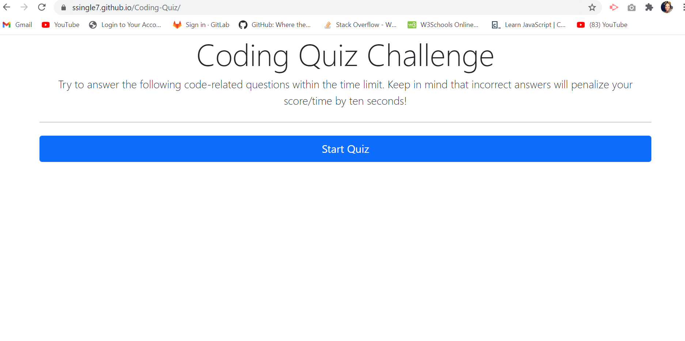

# Coding Quiz

The coding quiz assessment was designed as a typical coding assessment with a combination of multiple-choice questions and interactive coding challenges. In becoming a full-stack web developer, an assessment is sometimes included in the interview process. This project allows you to apply your Javascript fundamental skills in a timed coding quiz that has been dynamically updated with HTML and CSS powered by JavaScript code.The result is that you can gauge your progress on what you have learned. 

-Created separate files to house each of the HTML, CSS and javascript. 

-Pseudo codes where used to determine what divs, elements, and functions would be required to build quiz assessment. 

-Added bootstrap component to HTML and added divs, ids, and classes to target these within the script.js file.

-Arrays were added to house the questions and answers with a for loop to ensure that the next set of questions were displayed on the screen. 

-Used DOM manipulation 

 

# Installation

To run this locally, fork the repo, clone it, and open the 'index.html' in your default browser.  

## Usage

This application should be deployed within a browser and when the start button is selected for the quiz , the user should follow the prompts as they appear on the screen to select the correct answer 

### Credits

* Used Bootstrap's grid system, (containers, rows, and columns).

* W3 Schools 

* 02-ask-the-class

* Study Groups 

* 03-resources  

### Moc-Up

### License 

Copyright (c) [2020] [Selena Singleton]

Permission is hereby granted, free of charge, to any person obtaining a copy
of this software and associated documentation files (the "Software"), to deal
in the Software without restriction, including without limitation the rights
to use, copy, modify, merge, publish, distribute, sublicense, and/or sell
copies of the Software, and to permit persons to whom the Software is
furnished to do so, subject to the following conditions:

The above copyright notice and this permission notice shall be included in all
copies or substantial portions of the Software.

THE SOFTWARE IS PROVIDED "AS IS", WITHOUT WARRANTY OF ANY KIND, EXPRESS OR
IMPLIED, INCLUDING BUT NOT LIMITED TO THE WARRANTIES OF MERCHANTABILITY,
FITNESS FOR A PARTICULAR PURPOSE AND NONINFRINGEMENT. IN NO EVENT SHALL THE
AUTHORS OR COPYRIGHT HOLDERS BE LIABLE FOR ANY CLAIM, DAMAGES OR OTHER
LIABILITY, WHETHER IN AN ACTION OF CONTRACT, TORT OR OTHERWISE, ARISING FROM,
OUT OF OR IN CONNECTION WITH THE SOFTWARE OR THE USE OR OTHER DEALINGS IN THE
SOFTWARE.

